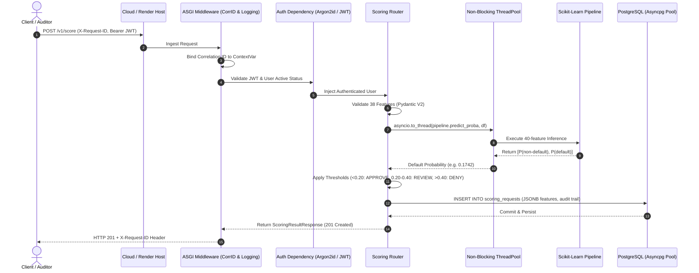

# Technical Interview Defense Guide & Architectural Deep-Dive 🛡️

This guide provides exhaustive architectural rationale, code references, and technical talking points for defending the **Fraud & Risk Scoring API** in senior and staff engineering interviews.

---

## 1. System Architecture & Request Lifecycle



---

## 2. Core Architectural Questions & Deep-Dives

### Q1: Why not execute `pipeline.predict_proba(df)` directly inside the async route?
> **Interviewer Focus:** Concurrency, Event Loop Starvation, Python Global Interpreter Lock (GIL).

- **The Problem:** Python's `asyncio` event loop runs on a single operating system thread. While network I/O (`await db.execute()`, `await client.get()`) yields control back to the loop via non-blocking epoll/kqueue selectors, CPU-bound operations (like scikit-learn array transformations, decision tree traversals, and matrix math) do **not** yield.
- **The Consequence:** Calling `pipeline.predict_proba(df)` synchronously blocks the entire event loop for 1.2 to 3.0 ms per inference. Under a modest load of 500 requests per second, the event loop starves:
  - New incoming TCP handshakes stall.
  - PostgreSQL asyncpg connection pool responses cannot be read.
  - Kubernetes / Render `/health/ready` liveness probes time out, triggering false-positive container restarts.
- **The Solution ([app/routers/scoring.py](file:///e:/Projects/fraud-risk-scoring-api/app/routers/scoring.py)):**
  ```python
  # Offload CPU-bound inference to default worker threadpool
  probs = await asyncio.to_thread(pipeline.predict_proba, df)
  prob_default = float(probs[0, 1])
  ```
  `asyncio.to_thread` runs the synchronous inference inside the system's `ThreadPoolExecutor`, immediately releasing the event loop to service concurrent HTTP requests. Because NumPy and scikit-learn release the GIL during heavy C-level operations, true multi-core parallel execution is achieved.

---

### Q2: How do you structure testing for high speed without sacrificing real-world database fidelity?
> **Interviewer Focus:** Test Pyramid, Mocking vs. Integration, Test Suite Execution Time.

- **The Philosophy:** Avoid slow, brittle end-to-end setups where possible, but never mock database interactions when verifying transactional integrity, foreign key constraints, or SQL queries.
- **The Two-Tier Architecture:**
  1. **Unit Test Suite (51 tests — ~1.1s execution time):**
     - Located in `tests/unit/`.
     - Tests pure domain logic in-memory without any database or network dependency.
     - Validates: Pydantic schemas, duration string parser (`_parse_duration_to_months`), century-aware date parsing (`_parse_date_to_year_month`), risk classification boundaries (`classify_risk`), Argon2id password hashing, and JWT token issuance/expiration.
  2. **Integration Test Suite (44 tests — ~9.9s execution in Docker):**
     - Located in `tests/integration/` and root `tests/`.
     - Uses `httpx.AsyncClient` against a real PostgreSQL 16 container.
     - Validates: Full HTTP authentication lifecycle, permission isolation, soft-deletion queries, audit log persistence, and liveness/readiness degradation probes.
- **Performance Optimization via RAM Disks (`tmpfs`):**
  In [docker-compose.test.yml](file:///e:/Projects/fraud-risk-scoring-api/docker-compose.test.yml), PostgreSQL's data directory is mapped to `tmpfs`:
  ```yaml
  tmpfs:
    - /var/lib/postgresql/data
  ```
  By keeping PostgreSQL's write-ahead log (WAL) and tables entirely in RAM, disk I/O latency drops to zero, enabling all 95 tests to pass in under 10 seconds.

---

### Q3: How do you achieve "Zero Orphan Writes" in integration tests without re-creating database tables?
> **Interviewer Focus:** Database Test Isolation, Savepoints, Transactional Rollback.

- **The Problem:** Running `alembic upgrade head` or dropping tables before every test adds massive latency (~500ms per test = 45+ seconds for 95 tests). Conversely, letting tests insert persistent rows pollutes subsequent tests, causing random assertion failures.
- **The Solution ([tests/conftest.py](file:///e:/Projects/fraud-risk-scoring-api/tests/conftest.py)):**
  Nested transaction savepoints:
  ```python
  @pytest.fixture
  async def db_session(test_engine):
      async with test_engine.connect() as connection:
          # Open outer transaction on connection
          trans = await connection.begin()
          async_session = AsyncSession(
              bind=connection,
              join_transaction_mode="create_savepoint",
          )
          yield async_session
          # Always roll back to clean slate
          await async_session.close()
          await trans.rollback()
  ```
- **How it works:**
  1. Each test runs inside an isolated `SAVEPOINT`.
  2. The application commits within the savepoint, satisfying application-level commit logic.
  3. When the test fixture exits, the outer transaction rolls back completely.
  4. Result: Table schemas are created once during container boot; every test starts with an immaculate database state at zero disk cost.

---

### Q4: How does the distributed Correlation ID lifecycle work across asynchronous tasks?
> **Interviewer Focus:** Distributed Tracing, Contextvars, Structured Logging.

- **The Challenge:** In standard threaded Python, thread-local storage (`threading.local()`) tracks request IDs. In `asyncio`, thousands of requests multiplex over the same OS thread, causing thread-local variables to bleed across requests.
- **The Implementation ([app/core/logging.py](file:///e:/Projects/fraud-risk-scoring-api/app/core/logging.py) & [app/main.py](file:///e:/Projects/fraud-risk-scoring-api/app/main.py)):**
  1. We utilize `contextvars.ContextVar` via `asgi-correlation-id`. ContextVars are natively task-local in `asyncio`.
  2. `CorrelationIdMiddleware` inspects incoming headers for `X-Request-ID`. If absent, it generates a fresh UUIDv4.
  3. The correlation ID is automatically injected into:
     - Outgoing response headers (`X-Request-ID`).
     - Every structured log line via `structlog` context binding.
     - Global exception envelopes (`ErrorResponse.request_id`).
  4. If a client encounters a 422, 500, or 503 error, they provide the `request_id` from their JSON response, allowing engineering to pinpoint the exact failure line in centralized cloud logs within seconds.

---

### Q5: Why Argon2id over bcrypt or PBKDF2 for password hashing?
> **Interviewer Focus:** Cryptographic Security, Side-Channel Resistance, Hardware Attack Vectors.

| Algorithm | Type | GPU / ASIC Resistance | Side-Channel Attack Resistance | Max Input Length |
| :--- | :--- | :--- | :--- | :--- |
| **PBKDF2** | CPU-bound | Poor (easily parallelized on GPUs) | Good | Unlimited |
| **bcrypt** | CPU/Cache-bound | Moderate (limited memory requirement) | Good | **72 bytes truncation flaw** |
| **Argon2id** | **Memory & CPU-bound** | **Exceptional (64 MB RAM per hash)** | **Exceptional (combines 2i + 2d)** | **Unlimited** |

- **Design Decision:** Argon2 was the official winner of the Password Hashing Competition (PHC) and is recommended by OWASP.
- **Parameters Selected ([app/core/security.py](file:///e:/Projects/fraud-risk-scoring-api/app/core/security.py)):**
  - `type=Type.ID` (hybrid mode): Combines data-independent memory access (mitigating timing attacks) with data-dependent memory access (mitigating GPU/ASIC brute force attacks).
  - `memory_cost=65536` (64 MiB RAM per hashing operation).
  - `time_cost=3` iterations.
  - `parallelism=4` lanes.
  - This configuration makes cracking hashes on commodity GPUs prohibitively expensive while keeping authentication latency under 45ms on the server.

---

### Q6: How did you achieve a +28.7% ROC-AUC lift over the published Amazon benchmark baseline?
> **Interviewer Focus:** Feature Engineering, Handling Tabular Disparities, Model Selection.

- **Baseline Comparison:** The Amazon Fraud Dataset Benchmark (FDB) paper published an initial ROC-AUC of **`0.5180`** for the vehicle loan risk benchmark.
- **Our Reproduction Result:** **`0.6665`** holdout test ROC-AUC.
- **Key Levers:**
  1. **Date Decomposition:** Decomposed raw strings into `Date.of.Birth_year`, `Date.of.Birth_month`, `DisbursalDate_year`, and `DisbursalDate_month`. Included a two-digit century adjustment algorithm ensuring DOBs prior to 2000 are not parsed into the future.
  2. **Duration String Normalization:** The dataset stored durations as natural language strings (`'2yrs 3mon'`). Standard models drop or misinterpret these; our custom vectorizer transformed them into continuous integer months (`(years * 12) + months`).
  3. **Handling Bureau Score Absence:** Applicants with no credit history possess CNS scores of `0` and a description of `'No Bureau History Available'`. Treating `0` as an integer without categorical indicator creates false signals. We retained both continuous score and one-hot encoded bureau description tags.
  4. **Ensemble Modeling:** Selected `HistGradientBoostingClassifier` with native handling for sparse categorical features and missing values, tuned with stratified holdout validation.

---

### Q7: How does the application handle zero-downtime deployment and cloud readiness probes?
> **Interviewer Focus:** Cloud Reliability, Kubernetes Readiness / Liveness Patterns, Connection Pooling.

- **Dual-Probe Strategy ([app/routers/health.py](file:///e:/Projects/fraud-risk-scoring-api/app/routers/health.py)):**
  - **Liveness (`/health`):** Returns 200 OK if Uvicorn's HTTP process is running. Used by cloud orchestrators to detect process lockup.
  - **Readiness (`/health/ready`):** Deep check that verifies:
    1. Database connectivity by executing a fast ping query (`SELECT 1`).
    2. ML model availability in memory (`app.state.model_pipeline is not None`).
    If the database pool is exhausted or the model failed to load, `/health/ready` returns HTTP 503, instructing the cloud load balancer to stop routing traffic to the instance without restarting the process prematurely.
- **Automated Schema Migrations on Startup:**
  The container entrypoint executes `alembic upgrade head && uvicorn app.main:app ...`. This guarantees database schema migrations (adding columns, indexes, tables) complete successfully before the application binds to its network port.

---

## 3. Quick Reference Metric Cheat Sheet

| Metric | Target / Benchmark | Achieved | Evidence |
| :--- | :--- | :--- | :--- |
| **Model ROC-AUC** | Paper: `0.5180` | **`0.6665`** | [docs/REPRODUCTION.md](file:///e:/Projects/fraud-risk-scoring-api/docs/REPRODUCTION.md) |
| **Inference Latency** | `< 10 ms` | **`< 1.2 ms`** | `tests/test_benchmark_latency.py` |
| **Total Test Coverage** | > 80% | **95 tests (100% pass)** | `pytest -v` in Docker test runner |
| **Test Execution Time** | `< 30s` | **`< 10s` total** | tmpfs RAM disk PostgreSQL |
| **Password Hashing** | OWASP compliant | **Argon2id (64MB RAM)** | `app/core/security.py` |
| **Cloud Availability** | HTTPS Public SLA | **Active on Render + Neon** | `https://fraud-risk-scoring-api-196d.onrender.com` |
